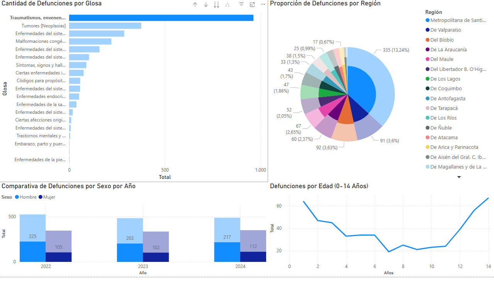

# Analisis_Defunciones_DEIS
Repositorio dedicado al análisis de datos de defunciones ocurridas en chile entre el años 2022 y 2025 (octubre)

El conjunto de datos lo puedes descargar aquí: https://drive.google.com/file/d/1qyD8Uc6QmCcAYfBD3iPKKJCSz2FOVAwr/view?usp=sharing

# 🔬 Proyecto de Análisis de Defunciones Infantiles (2022-2025)

---

## 🎯 1. Introducción y Objetivo del Proyecto

Este proyecto se enfoca en el **análisis exhaustivo del comportamiento de las defunciones en niños de 0 a 14 años** en Chile, utilizando datos oficiales para generar inteligencia demográfica y epidemiológica.

Los datos base provienen de la Dirección de Estadísticas de Información de Salud (**DEIS**), regida por el **Ministerio de Salud**, y cubren el período desde **Enero de 2022 hasta Octubre de 2025**.

El objetivo principal es transformar grandes volúmenes de datos en bruto en **Indicadores Clave de Rendimiento (KPIs)** que permitan hacer preguntas específicas y obtener *insights* accionables, como la correlación entre las causas de defunción y las variables demográficas.

---

## 🛠️ 2. Arquitectura de la Solución (Flujo de Datos)

La solución implementa un flujo de trabajo estructurado para garantizar la limpieza, centralización y el rendimiento del análisis.

1.  **Datos Fuente (DEIS):** Archivo Excel adjunto en el link inicial de Google Drive.
2.  **Transformación y Cálculo (Python):** El *script* en Python realiza la **lectura del archivo fuente**, aplica **limpieza inicial** y **prepara la estructura de datos**. Además, ejecuta el **cálculo de tasas de mortandad** utilizando los datos de defunciones obtenidos vía SQL junto a datos de población del **Censo 2024**.
3.  **Centralización y Procesamiento (Oracle SQL):** La base de datos Oracle centraliza la información para permitir **consultas complejas a gran escala**. Aquí reside la lógica PL/SQL (Procedimientos y Triggers).
4.  **Visualización (Power BI):** La herramienta se conecta a Oracle para consumir los datos limpios y los KPIs calculados, presentando el análisis final en un *dashboard* interactivo.

---

## 💻 3. Desarrollo y Programación en Base de Datos (PL/SQL)

La programación en PL/SQL fue esencial para garantizar la **fiabilidad** y el **rendimiento** del análisis de datos.

### 3.1. Procedimientos Almacenados (Cálculo de KPIs) 📊

Los procedimientos (`SP_...`) encapsulan toda la lógica compleja de cálculo en comandos simples.

* **Propósito:** Automatizar la obtención de **KPIs**, como la **desviación estándar de edad por causa**, el **mes con mayor defunciones**, o el **cálculo de proporción** de defunciones por lugar/región.
* **Flexibilidad:** Permiten el uso de **parámetros de entrada** (`IN`), haciendo que los análisis sean dinámicos (ej., filtrar la proporción de defunciones por **cualquier causa** ingresada por el usuario).

### 3.2. Triggers (Control de Calidad de Datos) 🛡️

Los *triggers* fueron implementados como la principal **barrera de integridad** para cualquier nueva inserción de datos en la tabla `PACIENTE`.

* **Propósito:** Asegurar la **Calidad y Consistencia del Dato Fuente** antes de que este afecte los KPIs.
* **Ejemplos de Control:**
    * **Normalización:** Valida que `SEXO_NOMBRE` sea consistente (solo "Hombre", "Mujer", o "Indeterminado"), independientemente de la capitalización de la entrada.
    * **Validación de Rango:** Impide la inserción de **`EDAD` negativa** y verifica que `EDAD_TIPO` esté dentro de los valores permitidos (0, 1, 2, 3, 4, 9).
    * **Referencialidad:** Garantiza que los códigos geográficos y de diagnóstico (`COD_COMUNA`, `CAPITULO_DIAG1`) existan en sus tablas maestras.

---

## 📈 4. Resultados Clave y Visualización (Power BI)

El *dashboard* en Power BI, alojado en la pestaña **"Analisis defunciones 0-14 años"**, consolida la información demográfica y clínica relevante para el estudio.

### Correlación Accidente vs. Sexo 💔

La pregunta hipótesis que guió el análisis fue: **¿Existe una correlación entre las defunciones por accidentes (Códigos CIE10: S99 - T98) y el sexo de los niños de entre 0 y 14 años?**

Mediante el procesamiento en SQL y los cálculos de tasas en Python, se concluyó:

> **Existe una probabilidad del 87% más alta de morir por accidente en niños varones** en comparación con las niñas hembras de la misma edad.

---

## 🚀 5. Ejecución e Instalación

Para replicar el análisis y la solución, siga estos pasos:

1.  **Descargar Datos:** Descargar el archivo Excel de 150 MB desde el enlace proporcionado en la **Sección 6**.
2.  **Configurar DB:** Ejecutar los *scripts* SQL para crear las tablas y los objetos PL/SQL (`.sql`) en su instancia de Oracle.
3.  **Carga Inicial:** Ejecutar el *script* Python de carga para poblar las tablas con los datos pre-procesados.
4.  **Análisis:** Abrir el archivo de Power BI (`.pbix`) y refrescar la conexión a la base de datos Oracle.

---
